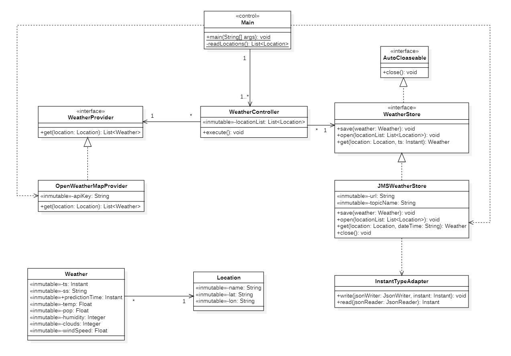
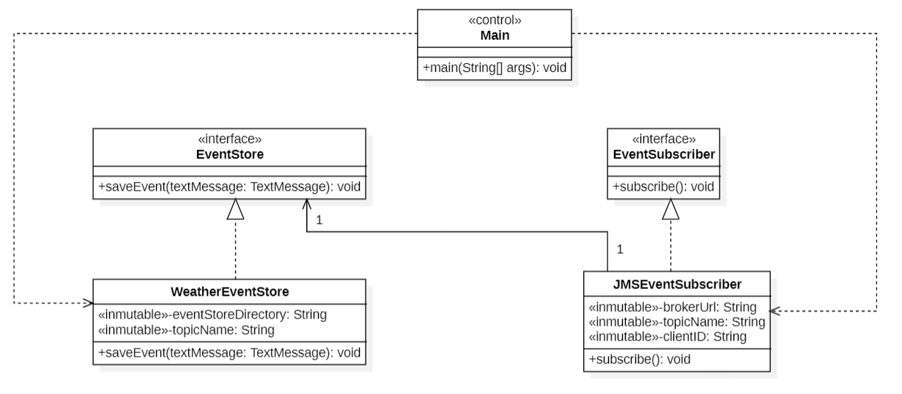

# Practice 2. Incorporating data into the system architecture
**Course:** Data Science Application Development

**Academic Year:** 2023-2024 

**Degree:** Data Science and Engineering

**School:** Escuela de Ingeniería Informática

**University:** Universidad de Las Palmas de Gran Canaria

## Summary of Functionality
This Java application consists of two modules: `prediction-provider` and `event-store-builder`.
Both modules will communicate through a broker, in this case, **Apache ActiveMQ**, which will act as a messaging
system for the publication and subscription of events.

### Prediction Provider Module
The `prediction-provider` module requests data from the
[OpenWeatherMap API](https://openweathermap.org/api) every 6 hours to obtain the weather forecast for the next five
days at 12 pm for the eight Canary Islands. It then converts the obtained data into JSON events and sends them to
the **prediction.Weather** topic.

### Event Store Builder Module
The `event-store-builder` module is responsible for subscribing to the **prediction.Weather** topic,
consuming the events and storing them in a given directory that follows the next structure:

   ```bash
  eventstore/prediction.Weather/{ss}/{YYYYMMDD}.events
   ```
Where `{ss}` represents the data source, and `{YYYYMMDD}` indicates the date of the event.

## Run the Project
### Run the Project in IntelliJ IDEA

This project can be run in IntelliJ IDEA by following these steps:

1. **Get the Code:** Download the code zip and unzip it wherever you want to store it.

2. **Open the Project:** Open IntelliJ IDEA and select "Open" from the main menu. Navigate to the project folder.

3. **Configure Run Arguments:** You must pass as arguments your OpenWeatherMap apikey. For example:

   ```bash
   your_api_key

Note: There are two modules, `prediction-provider` and `event-store-builder`. Configure the API key in both modules.

You can find more information to know how to set the Program Arguments in IntelliJ IDEA
[here](https://www.jetbrains.com/help/idea/run-debug-configuration-java-application.html).
4. You need to have the **Apache ActiveMQ broker** configured. For more information, go to 
[Apache ActiveMQ](https://examples.javacodegeeks.com/enterprise-java/jms/apache-activemq-hello-world-example/).

Note: When the broker starts up, it accepts connections on port 61616 by default. Check that the port is not busy.
5. **Run the project:** Click on the run button (green) next to the `main` method or press `Ctrl` `Shift` `F10` in
both modules.

### Run the Project using releases

#### Prerequisites
- Java Development Kit (JDK) installed.
- Apache ActiveMQ Broker installed.

#### Steps to Execute

1. **Download and extract the ZIP files:**
   Download the zip files corresponding to the Prediction Provider and Event Store Builder modules and unzip them.

2. **Configure Apache ActiveMQ:**
   Follow the instructions [here](https://activemq.apache.org/getting-started) to start the broker.

3.  **Configure the OpenWeatherMap API Key:**
    Provide the API key as a command line argument.
4. **Run the project:**
   - Open a terminal or command prompt.
   - Navigate to the extracted folders for Event Store Builder and Prediction Provider.
   - **Run the event-store-builder:**
     ```
     java -jar event-store-builder-1.0-SNAPSHOT-jar-with-dependencies.jar your_api_key
     ```
   - **Run the prediction provider:**
     ```
     java -jar prediction-provider-1.0-SNAPSHOT-jar-with-dependencies.jar your_api_key
     ```

Recommendations: open three terminals, as control does not return to the user until execution stops.
## Design
### Design Patterns and Principles Used
#### Design Patterns
The application employs the **Publisher/Subscriber** pattern to establish communication between the `prediction-provider`
and `event-store-builder` modules. The pattern facilitates the decoupling of the components, allowing them to work independently.
This is used as follows:
- The `JMSWeatherStore` class in the `prediction-provider` module acts as a publisher, sending weather events to the
`prediction.Weather` topic.
- The `JMSEventSubscriber` class in the `event-store-builder` module acts as a subscriber, listening for events on the
`prediction.Weather` topic.

Likewise, the **Observer** pattern is implemented through the `JMSEventSubscriber` class, which observes and reacts to the
events published in the `prediction.Weather` topic, waiting for new events.

Another pattern it uses is **Dependency Injection**, which is used to inject dependencies, such as the `WeatherEventStore`
instance, into the `JMSEventSubscriber` class. The `JMSEventSubscriber` constructor takes an `EventStore` parameter, allowing flexibility in the choice of event store implementation.
#### Design Principles
The application follows the SOLID design principles for a more maintainable and flexible code structure.

The first principle is the **Single Responsibility Principle (SRP)**, which ensures that each class in the application 
has a clear and defined responsibility. For instance, the `WeatherController` class manages weather control logic, 
`OpenWeatherMapProvider` supplies weather data, `JMSWeatherStore` sends weather events to the broker (ActiveMQ),
`JMSEventSubscriber` manages the subscription to JMS events and `WeatherEventStore` stores weather events in an
organized directory structure.

The **Open/Closed Principle (OCP)** is the second guiding principle.
It is intended to allow classes to be extended without having to change the existing code. An instance of this would 
be the `WeatherProvider` interface, which grants the possibility of introducing new weather providers to the 
`WeatherController` logic without modification or also the `EventStore` and `EventSubscriber` interfaces that allow
the extension of event storage and  subscription without altering the existing code.

The third principle is the **Liskov Substitution Principle (LSP)**, where derived classes, for example, 
specified implementations of stores or weather providers, can replace the base class without any alteration 
to the program's behaviour.

The fourth principle is the **Interface Segregation Principle (ISP)**.
Interfaces must be designed specifically, omitting unnecessary methods. For example, the `WeatherProvider` and 
`WeatherStore` interfaces provide only the methods necessary for their respective functions. This is also applicable
for the `EventStore` and `EventSubscriber` interfaces.

The last principle is the **Dependency Inversion Principle (DIP)**, where dependencies are inverted in order to separate 
high-level classes from low-level classes. For example, `WeatherController` depends on interfaces (`WeatherProvider`
and `WeatherStore`) instead of specific implementations.

### Class Diagram and Dependencies
#### Prediction Provider Module

#### Event Store Builder Module

