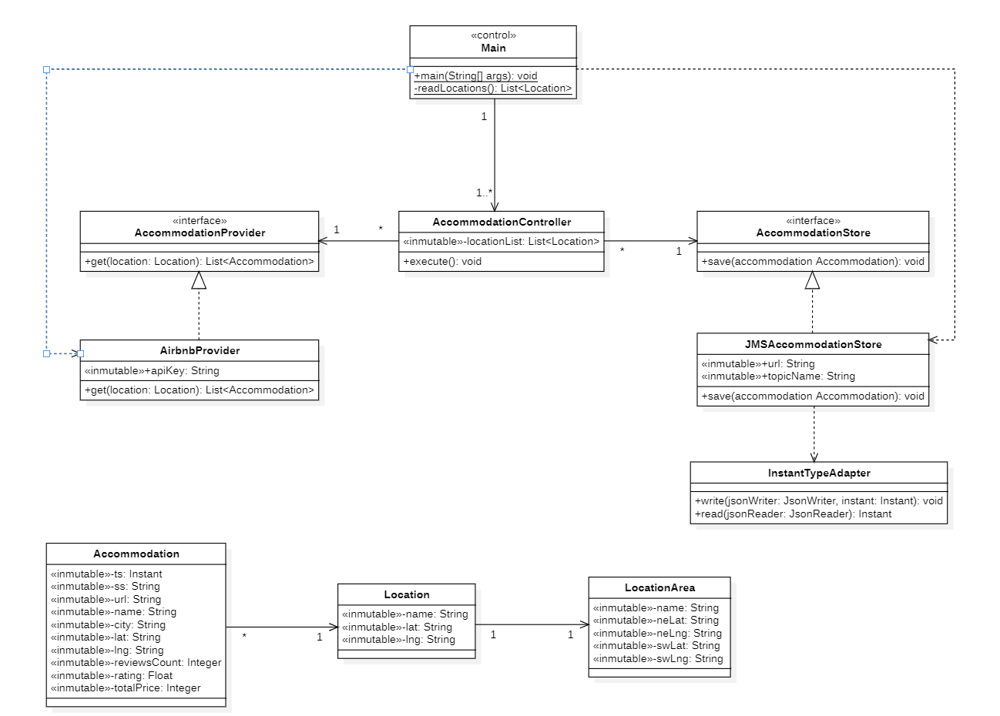
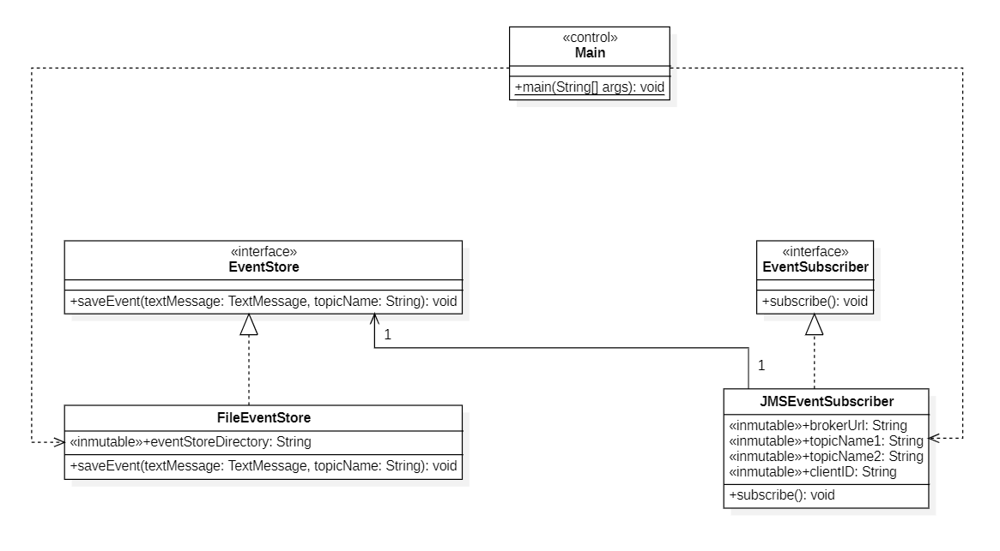
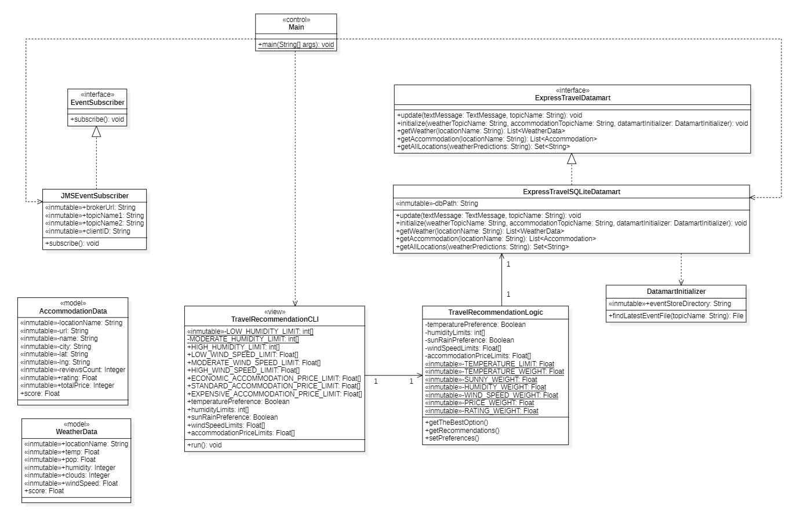

# Final Project. Express Travel Advisor Application
**Course:** Data Science Application Development

**Academic Year:** 2023-2024 

**Degree:** Data Science and Engineering

**School:** Escuela de Ingeniería Informática

**University:** Universidad de Las Palmas de Gran Canaria

## Summary of Functionality
The application aims to provide express destination recommendations for couples, taking into account various factors
such as weather and accommodation preferences. Weather data and accommodation availability will be integrated to offer
personalized suggestions to users.

This Java application consists of four modules: `prediction-provider`, `accommodation-provider`,
`datalake-builder` and `express-travel-advisor`.
The modules will communicate through a broker, in this case, **Apache ActiveMQ**, which will act as a messaging
system for event publishing and subscription.

### Prediction Provider Module
The `prediction-provider` module requests data from the
[OpenWeatherMap API](https://openweathermap.org/api) every 6 hours to obtain the weather forecast for the next five
days at 12 pm for the eight Canary Islands. It then converts the obtained data into JSON events and sends them to
the **prediction.Weather** topic.

### Accommodation Provider Module
The `accommodation-provider` module requests data from the
[Airbnb Rapid API](https://rapidapi.com/3b-data-3b-data-default/api/airbnb13/) every 6 hours to obtain the availability
of accommodation for the next five days in the chosen area in each of the eight Canary Islands.
It then converts the obtained data into JSON events and sends them to the **prediction.Accommodation** topic.

### Datalake Builder Module
The `datalake-builder` module is responsible for subscribing to the **prediction.Weather** and **prediction.Accommodation** topics,
consuming the events and storing them in a given directory that follows the following structure:

   ```bash
  eventstore/{topicName}/{ss}/{YYYYMMDD}.events
   ```
Where `{topicName}` represents the name of the topic the data comes from, `{ss}` represents the data source, and `{YYYYMMDD}` indicates the date of the event.

### Express Travel Advisor Module
The `express-travel-advisor` module has been designed with the main objective of leveraging information from
sensorization to provide customized recommendations for couples' express trips. This module consumes events from
the `prediction.Weather` and `prediction.Accommodation` topics, processing and storing them in a SQL datamart
implemented with SQLite. The datamart is continuously updated with new events as they arrive, ensuring that the latest
information is available for analysis and recommendation generation.


## Run the Project
### Run the Project in IntelliJ IDEA

This project can be run in IntelliJ IDEA by following these steps:

1. **Get the Code:** Download the code zip and unzip it wherever you want to store it.

2. **Open the Project:** Open IntelliJ IDEA and select "Open" from the main menu. Navigate to the project folder.

3. **Configure Run Arguments:** Add the necessary arguments for each module.

   For example, for `accommodation-provider`, it might look like this:

      ```bash
      your_airbnb_api_key
   ```
   And for `prediction-provider`:
      ```bash
      your_openweathermap_api_key
   ```
   For `datalake-builder`, you can add the root directory from which to create the datalake directory and its
subdirectories:
      ```bash
      /path/to/your/root/directory
   ```
   And for `express-travel-adviso`r, add the path to the database corresponding to the datamart:
      ```bash
      /path/to/your/database/datamart.db
   ```

You can find more information to know how to set the Program Arguments in IntelliJ IDEA
[here](https://www.jetbrains.com/help/idea/run-debug-configuration-java-application.html).

4. You need to have the **Apache ActiveMQ broker** configured. For more information, go to 
[Apache ActiveMQ](https://examples.javacodegeeks.com/enterprise-java/jms/apache-activemq-hello-world-example/).

Note: When the broker starts up, it accepts connections on port 61616 by default. Check that the port is not busy.

5. **Run the project:** Click on the run button (green) next to the `main` method or press `Ctrl` `Shift` `F10` in
the four modules.

### Run the Project using releases

#### Prerequisites
- Java Development Kit (JDK) installed.
- Apache ActiveMQ Broker installed.

#### Steps to Execute

1. **Download and extract the ZIP files:**
   Download the zip files for the Accommodation Provider, Prediction Provider, Datalake Builder, and Express Travel Advisor
modules. Unzip them in your preferred directory.

2. **Configure Apache ActiveMQ:**
   Follow the instructions [here](https://activemq.apache.org/getting-started) to start the broker.

3.  **Configure API Keys and Directories:**
    Provide the necessary API keys and directories as command line arguments for each module.
4. **Run the project:**
   - Open a terminal or command prompt.
   - Navigate to the directories where you extracted each module.
   - **Run Datalake Builder`:**
     ```
     java -jar datalake-builder-1.0-SNAPSHOT-jar-with-dependencies.jar /path/to/your/root/directory
     ```
   - **Run Express Travel Advisor:**
     ```
     java -jar express-travel-advisor-1.0-SNAPSHOT-jar-with-dependencies.jar /path/to/your/database/datamart.db
     ```
   - **Run Accommodation Provider:**
     ```
     java -jar accommodation-provider-1.0-SNAPSHOT-jar-with-dependencies.jar your_airbnb_api_key
     ```
   - **Run Prediction Provider:**
     ```
     java -jar prediction-provider-1.0-SNAPSHOT-jar-with-dependencies.jar your_openweathermap_api_key
     ```
Note: Open separate terminals for each module, as control does not return to the user until execution stops.
## Design
### Design Patterns and Principles Used

## Design Patterns
### Publisher/Subscriber Pattern
The application employs the **Publisher/Subscriber** pattern to establish communication between various modules.
This pattern facilitates the decoupling of components, allowing them to work independently. The interaction is as follows:
- The `JMSWeatherStore` and `JMSAccommodationStore` classes of the `prediction-provider` and `accommodation-provider`
modules act as publishers, sending events to the `prediction.Weather` and `prediction.Accommodation` topics.
- The `datalake-builder` and `express-travel-advisor` modules act as subscribers consuming the events of the
`prediction.Weather` and `prediction.Accommodation` topics.
### Observer Pattern
Also, the **Observer** pattern is implemented through the `JMSEventSubscriber` classes, which observe and react to the
events published in the `prediction.Weather` and `prediction.Accommodation` topics, waiting for new events.
### Dependency Injection
**Dependency Injection** is used to inject dependencies, such as the `WeatherEventStore` and `AccommodationEventStore`
instances, into various classes. Constructors of these classes take relevant parameters, allowing flexibility in
choosing the implementation.

## Design Principles
### SOLID Principles
The application follows the SOLID design principles for a more maintainable and flexible code structure.

The first principle is the **Single Responsibility Principle (SRP)**, which ensures that each class in the application has
a clear and defined responsibility. For instance, the `WeatherController` class manages weather control logic,
`OpenWeatherMapProvider` supplies weather data, `JMSWeatherStore` sends weather events to the broker (ActiveMQ),
`JMSEventSubscriber` manages the subscription to JMS events and `FileEventStore` stores events in an organized
directory structure.

The **Open/Closed Principle (OCP)** is the second guiding principle. It is intended to allow classes to be extended without
having to change the existing code. An instance of this would be the `WeatherProvider` or `AccommodationProvider` interfaces,
which grant the possibility of introducing new weather or accommodation providers to the WeatherController or Accommodation
logic without modification or also the EventStore and EventSubscriber interfaces that allow the extension of event storage
and subscription without altering the existing code.

The third principle is the **Liskov Substitution Principle (LSP)**, where derived classes, for example, specified
implementations of stores or weather or accommodation providers, can replace the base class without any alteration to the
program's behaviour.

The fourth principle is the **Interface Segregation Principle (ISP)**. Interfaces must be designed specifically,
omitting unnecessary methods. For example, the `WeatherProvider` and `WeatherStore` interfaces provide only the methods
necessary for their respective functions. This is also applicable for the `AccommodationProvider`, `AccommodationStore`,
`EventStore` and `EventSubscriber` interfaces.

The last principle is the **Dependency Inversion Principle (DIP)**, where dependencies are inverted in order to separate
high-level classes from low-level classes. For example, `WeatherController` depends on interfaces (`WeatherProvider` and
`WeatherStore`) instead of specific implementations. The same is true for the accommodations.


### Class Diagram and Dependencies
#### Prediction Provider Module

#### Accommodation Provider Module

#### Datalake Builder Module

#### Express Travel Advisor Module

